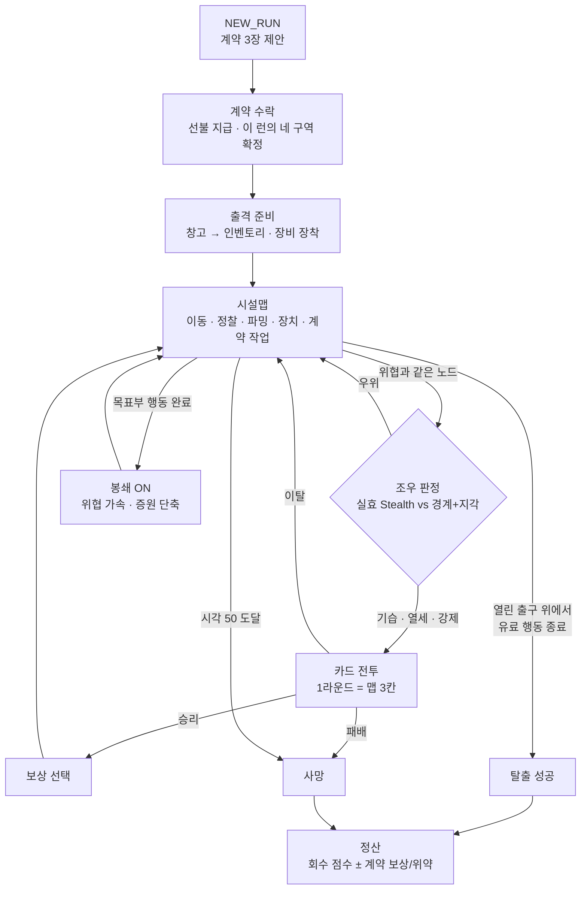

# 기획자용 시스템 설명

이 폴더는 **이 프로젝트를 처음 보는 기획자**가 게임의 모든 시스템과 현재 수치, 그리고 그 뒤에 있는 설계 의도를 한 번에 읽을 수 있게 정리한 문서 묶음이다.

- 모든 수치는 `src/data/*.js`와 `src/engine/*.js` **코드에서 직접 읽어** 적었다. 상수 이름을 처음 나올 때 백틱으로 함께 적으므로, 값을 확인하거나 바꾸려면 그 이름으로 코드를 찾으면 된다.
- 문서와 코드가 어긋날 때는 코드가 이긴다([CONTEXT.md](../../CONTEXT.md)의 권위 순서). 기존 문서에 없고 코드에만 있는 규칙은 "(코드에서 확인)"이라고 표시했다.
- 설계 의도는 `docs/adr/`의 결정 기록을 요약하고 ADR 번호를 함께 적었다.
- 이 폴더는 **설명용**이다. 값을 바꾸는 작업은 코드 → 테스트 → `npm run docs:reference` 순서로 하고, 그 뒤에 여기를 갱신한다.

## 한 문단 요약

**카드 익스트랙션**은 카드 전투와 시설 침투를 한 런으로 묶은 로그라이트 프로토타입이다. 플레이어는 계약 한 건을 수락하고, 창고에서 무기·방어구·모듈·임플란트·소모품을 골라 출격한다. 장착한 장비는 **전투 덱의 카드**와 **시설에서 쓸 여섯 가지 Capability**(지각·은신·해킹·기동·파괴·기만)를 동시에 만든다. 시설은 여덟 구역 정의 중 네 개를 뽑아 만든 90~124개 노드짜리 평면도이고, 이동은 어느 통로든 **1칸**인 대신 정찰·파밍·장치 조작·전투는 저마다 길이가 다른 **게이지**를 그 자리에서 대기로 채워야 끝난다. 시간이 흐르면 위협 마커가 움직이고 소음과 증거가 경계도를 올린다. 목표는 시설을 다 비우는 것이 아니라 **붕괴(80칸) 전에 탈출하는 것**이며, 표준 출구 A는 50칸에 영구 폐쇄된다. 무엇을 포기하고 언제 나갈지가 이 게임의 중심 결정이다.

## 런의 흐름

## 읽는 순서와 목차

처음이면 01 → 03 → 05 → 06 순서로 읽으면 게임의 뼈대가 잡힌다. 나머지는 필요할 때 찾아 읽어도 된다.

| 문서 | 내용 |
|---|---|
| [01 런의 흐름](./01-run-flow.md) | 화면 순서, 커맨드, 런 사이에 남는 것과 리셋되는 것 |
| [02 계약과 구역](./02-contracts-and-sectors.md) | 계약 세 유형, 구역 추첨, 여덟 배치 원형, 랜드마크, 출구 배치 |
| [03 맵 시간과 마감](./03-map-time-and-deadlines.md) | 칸, 가동과 게이지, 행동 비용표, 붕괴 80 / A 폐쇄 50, 봉쇄, 증원, 실측 중앙값 |
| [04 관측과 정보](./04-observation-and-information.md) | 무료 인접 시야, 정찰, 정보 깊이표, 카메라·인터페이스가 파는 정보 |
| [05 Capability와 층계](./05-capabilities-and-ladder.md) | 여섯 Capability, 장비 보정, 층계 다섯 단계와 통화, 행동별 요구치·비용 |
| [06 위협·경계도·수습](./06-threats-alert-and-recovery.md) | 위협 이동, 소음 전파, 조우 3단계, 경계 게이지, 수습 수단 |
| [07 현장 장치와 장비 행동](./07-field-equipment-and-devices.md) | 카메라, 접속 인터페이스, 발전기, 특수 엣지, 장비 능동 효과 |
| [08 전투](./08-combat.md) | 턴 구조, 상태이상, 과부화 토글, 탄약, 짐 카드, 이탈, 맵 연결 |
| [09 몬스터](./09-monsters.md) | 전 몬스터 스펙과 행동열, 위협 마커 → 전투 편성 |
| [10 장비·카드·로드아웃](./10-equipment-cards-and-loadout.md) | 슬롯, 무기·방어구·모듈·임플란트, 카드 목록, 내구도, 창고 |
| [11 파밍·인벤토리·보상](./11-farming-inventory-and-rewards.md) | 현장 기회, 3택 1, 과적, 전투 보상, 열쇠, 런 정산 |
| [12 미해결 항목](./12-open-questions.md) | 확정됐지만 미구현 / 아직 결론 없는 것 |

전체 수치 목록은 코드에서 자동 생성하는 [참조 엑셀](../card-extraction-reference.xlsx)에도 시트별로 들어 있다(`카드 일람`, `무기`, `방어구`, `모듈`, `임플란트`, `몬스터 스펙`, `몬스터 행동`, `맵 구성요소`, `규칙`).
