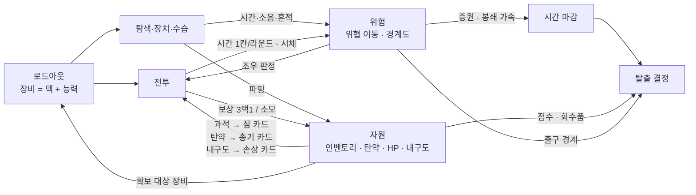

# 05. 시스템 간 연결 구조

개별 시스템은 따로 놀지 않는다. 이 문서는 전투 · 탐색 · 자원 · 성장 · 위험 · 탈출 여섯 덩어리가 서로를 어떻게 밀고 당기는지 정리한다.

## 한 장의 그림



읽는 법: 로드아웃이 모든 것의 입구다. 탐색과 전투는 둘 다 **시간**을 쓰고 **위험**을 남긴다. 자원은 전투와 탐색을 오가며, 결국 시간과 위험이 **탈출 결정**을 압박한다.

## 행동 → 보상 → 비용 → 다음 판단

| 행동 | 즉각적인 보상 | 발생하는 비용 / 위험 | 다음 판단에 미치는 영향 |
|---|---|---|---|
| 정찰 | 옆방 내용물의 정체, 위협 상세 | 2칸. 순찰은 다섯 칸에 한 홉이라 대개 제자리다 | 파밍 가치와 조우 결과를 미리 계산할 수 있다 |
| 이동 | 위치 변경 | 어느 통로든 1칸. 은신 2 이하면 흔적 | 흔적이 발견되면 위협이 몰린다. 강한 흔적이면 경계도까지 |
| 보급 파밍 | 아이템 하나 즉시 | 3칸, 소음 1, 인벤토리 1칸 | 인벤토리가 차면 다음 파밍이 짐이 된다 |
| 확보 파밍 | 후보 3개 중 장비 하나 | 5~7칸, 소음 2~3, 그 방에 머묾 | 빌드가 바뀐다. 능력이 바뀌면 열리는 문과 조우 결과가 바뀐다 |
| 문 뜯기 | 통로 개방(영구) | 3칸, 소음 2. 위협도 그 길을 쓴다 | 짧은 길이 생기지만 추적 경로도 생긴다 |
| 문 해킹 | 통로 개방(영구), 카메라는 15칸 | 2칸, 조용. 모자라면 경계도 | 돌아올 때 카메라가 살아 있다 |
| 기습 전투 | 적 전원 기절 후 선공, 보상 3택 1 | 라운드당 1칸, HP·탄약·내구도, 시체 | 시체를 치울지(3칸) 두고 갈지. 증원이 자리를 채운다 |
| 무시 | 0칸 | 위협이 그 자리에 남는다 | 돌아올 길이 막힐 수 있다 |
| 회피 | 추적 끊김 | 1칸 | 다음 행동 뒤 재판정 |
| 계약 목표 작업 | 계약 완료 조건 진행 | 3~5칸, **봉쇄 시작** | 이후 모든 시간 계산이 다시 짜인다. 파밍은 위험해지고 출구가 급해진다 |
| 수습 | 경계도 하락·이동·정지, 흔적 제거 | 2~4칸, 일부는 소음 3 | 그 구역을 다시 지날 수 있게 된다. 옆 구역이 위험해질 수 있다 |
| 탈출구 가동 | 개방 게이지 시작 | 가동 1칸을 포함해 전체 5~2칸. 위협이 출구로 모인다 | 게이지가 도는 동안 조우를 어떻게 넘길까 |

## 여섯 덩어리의 관계

### 전투 ↔ 탐색

- 같은 시계를 쓴다. 전투 한 라운드는 1칸이고 순찰 위협 한 걸음은 5칸이라, 전투 한 번(6~10칸)이 순찰 한두 걸음이다.
- 조우 판정이 둘 사이의 문이다. 탐색 쪽 결정(어디서 마주칠까, 카메라를 먼저 껐나, 은엄폐가 있나)이 전투의 시작 조건(선공, 기절, 추가 1칸)을 정한다.
- 전투가 남기는 시체는 탐색의 위험이 된다.
- 발전기라는 탐색 쪽 장치가 전투의 초기 조건(적 갑옷 5)을 바꾼다.
- **현재 끊긴 곳**: 전투 소음이 꺼져 있어 "조용히 이기기"가 탐색에 영향을 주지 않는다. 전투 이탈 뒤 위협이 추적 상태로 돌아가지 않는다.

### 탐색 ↔ 자원

- 파밍이 자원의 유일한 유입이고, 파밍은 시간·소음·공간을 쓴다.
- 인벤토리 용량이 파밍의 상한이다. 넘치면 벌은 전투에서 받는다.
- 탄약은 인벤토리 칸을 먹는 자원이면서 총기 덱의 생명이다. 파밍으로 탄약을 챙기면 점수 칸이 줄어든다.

### 자원 ↔ 전투

- 탄약(장전), 내구도(손상 카드), 과적(짐 카드), 소모품(퀵슬롯), HP 전부가 전투 안에서 소비되거나 덱을 오염시킨다.
- 전투 보상이 자원으로 돌아온다. 하지만 보상도 인벤토리 칸을 먹으므로 스킵이 선택지다.

### 자원 → 성장

- 이 게임의 "성장"은 런 안에서 확보 대상으로 얻은 장비를 끼우는 것이다. 장비를 바꾸면 덱과 능력이 함께 바뀐다(맵에서 건당 2칸).
- **현재 끊긴 곳**: 런을 넘겨 남는 것이 없다. 창고는 매 런 리셋되고 점수도 저장되지 않는다.

### 위험 ↔ 시간

- 시간이 흐르면 위협이 움직인다. 소음과 증거는 위협을 끌어들이고 경계도를 올린다. 경계도는 위협을 빠르게 만들고 증원을 당긴다.
- 봉쇄가 이 고리 전체를 한 단계 조인다.
- **현재 약한 곳**: 플레이어가 아무것도 안 하면 위험은 늘지 않는다. 증원은 빈자리만 채우고 경계도는 플레이어의 사건에만 반응한다. 시간 자체가 위험을 키우지 않는다.

### 위험·시간 → 탈출

- 표준 출구 폐쇄 150칸이 실질 마감이고 붕괴 240이 최후선이다. 열쇠는 보험이지만 우연히 나온다.
- 탈출구 가동이 위협을 출구로 모으고, 게이지 길이는 해킹 능력이 정한다.
- 출구가 있는 구역의 경계도가 탈출 난이도다. 수습을 어느 구역에 쓸지가 여기서 정해진다.

## 능력 하나가 닿는 곳

로드아웃이 왜 모든 것의 입구인지 보여주는 표다. 능력 한 축을 올리면 여러 시스템이 동시에 바뀐다.

| 능력 | 탐색 | 위험 | 전투 | 탈출 |
|---|---|---|---|---|
| 지각 | 정찰 깊이·사거리, 은엄폐 값 보기 | 흔적 정리, 카메라 저격 | (원거리 강화 모듈에 붙음) | — |
| 은신 | 흔적 남기지 않음 | 조우 우위, 카메라 안 걸림(카메라 방에서 실효 2 이상) | 기습 선공 | 게이지 도는 동안의 조우 |
| 해킹 | 전자문, 카메라, 인터페이스, 발전기 원격 | 통제실 장악(유일한 실제 하락) | 발전기 무력화로 적 갑옷 제거 | 가동 게이지 5→2칸 |
| 기동 | 고지대로 길이 열린다(이동 시간은 그대로 1칸) | — | 이탈 +1 시작 | 출구까지의 홉수 |
| 파괴 | 물리문, 카메라·발전기 파괴 | 전원 차단(30칸 정지, 은신 +1) | — | — |
| 기만 | 가짜 소음으로 시선 이동 | 가짜 목표 송출(경계 이동), 조우 속이기 | — | — |

## 한 판을 관통하는 인과 예시

```
카타나+중갑 빌드 (파괴 3, 은신 0)
 → 문을 다 뜯고 직진한다 (탐색이 빠르다)
  → 소음 2가 매번 2홉에 퍼진다 (위험이 는다)
   → 위협이 조사하러 오고, 은신 0이라 조우가 자주 열세다 (전투가 는다)
    → 열세 전투는 적 선공 + 1칸, 시체가 쌓인다 (시간과 경계도가 는다)
     → 경계도 2, 위협 이동 3칸 (탐색이 위험해진다)
      → 전원 차단으로 30칸을 사고 그 안에 목표부를 친다 (파괴 빌드의 수습)
       → 봉쇄. 은신 −1로 −1 (조우가 전부 열세)
        → 기동 2로 이탈을 반복하며 출구로 (전투를 버리고 시간을 산다)
         → 시각 140, 가동, 게이지 5칸 동안 위협 셋 도착 (마지막 긴장)
```

이 사슬이 빌드마다 다른 모양으로 나오는 것이 이 게임이 노리는 변주다.
