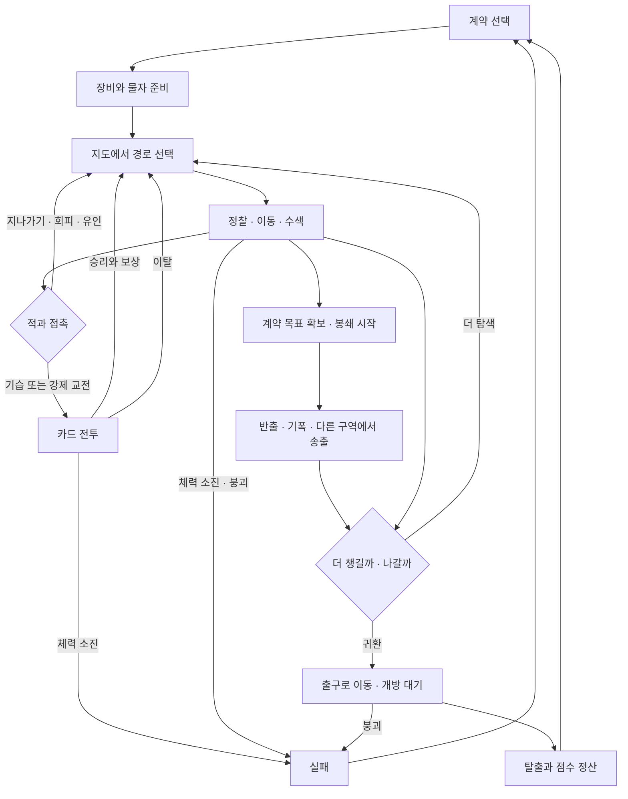

# 카드 익스트랙션 — 게임 기획서

> 조사 기준: 2026-09-15 현재 작업 폴더의 소스코드·게임 데이터·화면·에셋 구성.
> 독자: 게임 기획자, 아티스트, 프로그래머, 신규 합류자.

이 문서는 현재 플레이 가능한 규칙을 바탕으로 게임의 목적과 선택을 역으로 해석한 기획서다. **기본 규칙은 현재 동작**, **목적·핵심 경험·디자인 축은 그 동작에서 추론한 의도**다. 제안과 미완성 부분은 9장에서 따로 구분한다.

코드 이름과 검증 근거는 [구현 참조 부록](implementation-reference.md)에 모았다. 처음 합류했다면 마지막의 [한 페이지 요약](#10-한-페이지-요약)을 먼저 읽어도 된다.

## 0. 조사에서 먼저 정리한 게임의 실체

| 질문 | 현재 게임에서 확인한 답 |
|---|---|
| 1. 플레이어가 할 수 있는 행동 | 계약 선택, 장비·탄약 준비, 시설 이동, 정찰, 수색, 잠긴 길 개방, 감시 장치 조작, 유인, 흔적·시체 정리, 기습·회피, 카드 전투·이탈, 계약 작업, 탈출 요청 |
| 2. 플레이어가 얻으려는 것 | 살아서 반출한 물품의 점수와 계약 성과. 도중에는 생존에 필요한 탄약·회복품·장비·경로 정보를 얻는다 |
| 3. 플레이어를 방해하는 것 | 순찰과 추적, 카메라, 잠긴 문과 불리한 지형, 누적 경계, 줄어드는 시간, 부족한 탄약과 손상 장비, 수납 한도를 넘긴 짐 |
| 4. 반복되는 선택 | 안전과 속도, 정찰과 전진, 전투와 회피, 현금성 보상과 생존 도구, 목표 수행과 조기 탈출 |
| 5. 실패 조건 | 체력 0 또는 시설 시각 490칸 도달. 계약 미완수는 탈출 실패와 별개이며 점수 불이익이다 |
| 6. 성공 조건 | 살아 있는 동안 열린 일반 출구에 있거나, 열쇠 확보 후 열쇠 출구에 도달해 탈출 판정이 성립한다. 모든 적 처치나 계약 완료는 필수가 아니다 |
| 7. 주요 자원 | 체력, 남은 시간, 전투 행동력, 장전탄·예비탄, 수납 공간, 소모품, 장비 내구도. 정보와 안전한 경로도 소모 가능한 기회다 |
| 8. 핵심 위험 / 보상 | 더 챙기면 반출 가치가 늘지만 시간이 줄고 짐이 전투를 방해한다. 계약 목표를 확보하면 봉쇄가 시작되어 돌아오는 길이 어려워진다 |
| 9. 시스템 연결 | 장비가 카드와 침투 능력을 함께 결정한다. 탐색이 물자와 정보를 주고, 전투가 시간·체력을 소비하며 시체를 남긴다. 얻은 물자는 다음 전투와 탈출 가능성을 바꾼다 |
| 10. 독특한 요소 | 장비 선택이 전투와 경로 선택에 동시에 작용한다. 과적이 손패를 오염시킨다. 전투 중에도 시설의 시간이 흐른다. 목표를 얻는 순간이 작전의 끝이 아니라 귀환 위험의 시작이다 |

### 무엇이 중심이고 무엇이 보조인가

| 중요도 | 해당 요소 | 이 기획서에서의 위치 |
|---|---|---|
| 핵심 재미 | 계약과 봉쇄·탈출, 정보와 경로 선택, 조우와 카드 전투, 장비와 과적 | 플레이어의 반복 판단을 직접 만든다. 2~6장의 중심 |
| 핵심 재미 보조 | 장치 조작, 유인과 수습, 소모품, 내구도, 적 편성과 구역별 공간 차이 | 핵심 선택의 결과를 바꾸고 실패를 만회할 여지를 준다 |
| 편의 / 구현용 | 지도 확대·축소와 화면 정리, 자동 장착, 행동 기록·되돌리기, 개발용 전투 즉시 승리 | 읽기와 실험을 돕는다. 정상적인 게임 보상이나 캐릭터 능력으로 해석하지 않는다 |
| 존재하지만 현재 딜레마가 약한 요소 | 과부화 강화 | 비용 없는 강화 상태다. 핵심 위험 자원으로 설명하지 않는다 |

## 1. 게임 한 줄 설명

**장비로 만든 카드로 싸우며 시설의 물품과 계약 목표를 확보하고, 늘어나는 짐과 추적 위험 속에서 탈출 시점을 결정하는 턴제 생존 탐색 게임.**

플레이어는 방과 통로가 이어진 시설 지도를 이동한다. 적과 마주치면 은밀하게 지나가거나 카드 전투로 돌파한다. 중요한 것은 시설을 전부 정복하는 일이 아니라, 감당할 수 있는 성과를 들고 살아 나오는 일이다.

현재 한 판은 계약 선택부터 탈출·사망 정산까지다. 다시 시작하면 창고도 새로 만들어진다. 반출품으로 다음 판의 장비를 영구 강화하는 성장 순환은 아직 없다.

## 2. 게임이 주려는 핵심 경험

| 핵심 경험 | 플레이어가 느껴야 하는 감정 | 이를 만드는 상황 | 관련 요소 |
|---|---|---|---|
| **내가 짠 작전이 통한다** | 관찰하고 준비한 만큼 위험을 통제했다는 만족 | 순찰 이동을 읽고, 감시를 끊거나 지름길을 열어 목표까지 도달한다 | 정찰, 장비의 침투 능력, 장치, 조우 우위 |
| **하나만 더 챙기고 싶다** | 욕심과 불안 사이의 긴장 | 가까운 보상은 탐나지만 가방이 가득 찼고 출구 폐쇄가 다가온다 | 수색, 과적 카드, 탄약·체력, 출구 마감 |
| **작전이 틀어져도 살아 나간다** | 손실을 받아들이고 주도권을 되찾는 안도감 | 불리한 전투에서 이탈하거나, 흔적을 지우고 귀환 경로를 다시 고른다 | 전투 이탈, 수습, 소모품, 계약 포기와 탈출 |

세 번째 경험은 현재 일부 불완전하다. 전투 이탈은 가능하지만, 직후 안전하게 거리를 벌리는 과정과 소비 자원의 반영이 승리 때와 일치하지 않는다. 9장에서 구분한다.

## 3. 핵심 플레이 루프

| 단계 | 플레이어의 고민 |
|---|---|
| 계약 선택 | 짐을 운반할 것인가, 폭약을 설치하고 빠질 것인가, 데이터를 얻어 다른 구역까지 갈 것인가? |
| 준비 | 싸움에 강한 장비와 조용하고 빠르게 다니는 장비를 어떻게 섞을까? 탄약은 얼마나 가져갈까? |
| 경로 선택 | 목표까지 가는 길뿐 아니라 목표 확보 후 출구까지 이어지는 길도 확보했는가? |
| 정찰·탐색 | 시간을 내어 방의 내용과 적을 확인할까, 불확실성을 안고 들어갈까? |
| 접촉 대응 | 지금의 은신 우위를 이용해 지나갈까, 먼저 공격해 보상을 노릴까? |
| 전투 | 이번 턴에 적을 줄일까, 피해를 막을까, 이탈 준비를 할까? |
| 목표 확보 | 봉쇄를 켜기 전에 회복·수색·경로 개방을 더 해 둘까? |
| 귀환 판단 | 계약을 끝낼 시간이 있는가? 물건 일부나 계약 자체를 포기해야 하는가? |
| 탈출 | 출구 요청 후 기다릴 위치와 복귀 시간을 어떻게 잡을까? |
| 재도전 | 이번 실패의 원인을 장비와 경로 선택에 반영한다. 현재 남는 성장은 플레이어의 지식이다 |

**시간은 실제 초가 아니라 행동으로 흐르는 ‘칸’이다.** 생각하거나 보상을 고르는 동안 시간이 자동으로 줄지는 않는다. 이동·작업·대기와 전투 라운드가 시간을 보낸다.

## 4. 플레이어가 반복적으로 내리는 핵심 판단

선택의 가치는 버튼 수가 아니라, 상황이 달라졌을 때 답도 달라지는 데 있다.

| 핵심 판단 | 한쪽을 택할 이유 | 반대쪽을 택할 이유 | 판단 전에 필요한 정보 |
|---|---|---|---|
| **지금 목표를 확보할까, 귀환 준비부터 할까?** | 목표를 먼저 챙기면 계약 진척을 확보한다 | 봉쇄 전에 문을 열고 물자를 챙기면 귀환이 쉬워진다 | 목표 작업 시간, 출구까지 거리, 감시와 순찰 |
| **지금 정찰할까, 그대로 전진할까?** | 적의 상태와 방의 보상을 알면 낭비와 불리한 접촉을 줄인다 | 시간이 촉박하거나 이미 확인한 길이면 전진이 낫다 | 정보의 최신성, 정찰로 추가 공개되는 항목 |
| **안전하게 할까, 서두를까?** | 조용한 작업은 주변 적의 관심을 덜 끈다 | 빠른 작업은 순찰 도착 전이나 출구 폐쇄 전에 끝낼 수 있다 | 작업 시간·소음 예고, 적의 다음 이동 |
| **기습할까, 싸우지 않고 통과할까?** | 유리한 선공으로 위협을 없애고 장비 보상을 얻는다 | 체력·탄약·시간을 보존하고 시체도 남기지 않는다 | 적 편성, 손상 장비, 귀환 경로에 다시 올 적 |
| **적을 끝낼까, 이탈을 준비할까?** | 승리하면 해당 위협이 사라지고 보상이 생긴다 | 감당 못 할 손실을 끊고 생존을 택한다 | 적 의도, 남은 체력·탄약, 이탈 카드와 진행도 |
| **현금성 물품을 더 들까, 생존 물자를 남길까?** | 탈출 성공 점수가 높아진다 | 탄약과 회복품이 반출 성공 가능성을 지킨다 | 수납 여유, 과적 여부, 남은 교전 가능성 |
| **장비를 바꿀까, 현재 조합을 유지할까?** | 새 장비로 막힌 길이나 전투 약점을 해결한다 | 교체 시간과 카드 구성 변화, 잃는 침투 능력을 피한다 | 새 카드, 능력 증감, 내구도, 주변 위협 |
| **흔적을 치울까, 그 시간을 이동에 쓸까?** | 나중에 돌아올 길의 신고 위험을 줄인다 | 다시 오지 않을 곳이라면 시간을 아낀다 | 순찰 경로, 현재 경계, 청소 시간 |
| **계약을 끝낼까, 위약을 감수하고 탈출할까?** | 계약 점수와 회수품 가치를 확보한다 | 미완수여도 살아 나올 수 있다 | 남은 작업·이동·출구 개방 시간의 합 |

### 같은 상황에서도 목표에 따라 답이 바뀌어야 한다

가방이 찬 상태에서 현금성 물품과 탄약 중 하나를 고른다고 하자. 출구가 곧 열리고 싸움을 피할 수 있다면 물품이 매력적이다. 귀환 길에 강제 교전이 예상된다면 탄약이 더 가치 있다.

반대로 과부화는 현재 켜는 비용이 없다. 많은 카드가 강화되므로, 이를 ‘강한 능력을 쓰고 위험을 높일지 고민하는 선택’으로 소개하면 실제 게임과 달라진다.

## 5. 핵심 시스템

아래 예시는 **20~60초 정도에 읽고 선택할 수 있는 플레이 장면**이다. 실측 플레이 시간이 아니며, 시설 시간 1칸을 실제 1초로 환산하지 않는다.

### 5.1 계약과 봉쇄 — 목표를 얻은 뒤가 더 위험하다

**한 줄 설명:** 출격 전에 고른 일감이 목적지와 귀환 중 해야 할 일을 정한다.

**목적:** 무작정 모든 방을 뒤지는 대신 작전의 방향을 만든다. 목표 확보 전의 준비와 확보 후의 귀환을 서로 다른 국면으로 나눈다.

**기본 규칙**

| 계약 | 완료에 필요한 행동 | 특히 부담이 되는 것 |
|---|---|---|
| 회수 | 목표부에서 물품을 얻고 필요한 물품을 모두 가진 채 탈출 | 물품이 가방 1~3칸을 차지한다. 일부를 버리면 완료 조건을 잃는다 |
| 파괴 | 목표부에 폭약 설치 → 연결 거리 두 구간 이상 떨어짐 → 기폭 | 설치 후에도 이동과 기폭이 남는다 |
| 정보 | 목표부에서 데이터 확보 → 목표 구역과 이웃한 구역의 핵심시설에서 송출 | 다른 구역까지 이동하고 다시 작업해야 한다 |

매번 세 유형에서 하나씩 계약을 제안한다. 하나를 수락하면 선불 재화가 가방에 들어오고 목표 위치가 공개된다. 목표 구역은 해당 출격의 시설에 반드시 포함된다.

물품·데이터 확보나 폭약 설치가 끝나면 세 유형 모두 봉쇄가 시작된다. 적의 이동과 빈자리 보충이 빨라지고 은신이 불리해진다. **봉쇄가 일반 출구의 폐쇄 시각을 앞당기지는 않는다.**

**플레이어의 선택:** 목표부터 챙길지, 돌아갈 길과 물자를 먼저 준비할지 고른다. 완료 가능성이 낮아지면 계약을 버리고 생존을 택할 수 있다.

**보상과 위험:** 회수품은 물건 자체의 가치가 점수에 들어간다. 파괴·정보는 완료 점수가 더해진다. 미완수면 위약 점수가 빠지지만 탈출 자체는 가능하다. 선불은 현재 구매 자금보다는 들고 나갈 점수 물품에 가깝다.

**다른 시스템과의 관계:** 목표가 구역 선택과 경로를 정하고, 봉쇄가 조우 판정을 바꾸며, 회수 물품이 수납·카드 전투에 영향을 준다.

**플레이 예시 · 약 40초:** 표본고에 도착했다. 지금 집으면 가방 두 칸이 더 필요하고 봉쇄가 시작된다. 플레이어는 근처에서 준비를 더 할지 살핀다. 귀환 길의 전자문을 먼저 열기로 한다. 돌아와 표본을 챙긴 뒤에는 추가 수색을 포기하고 출구로 향한다.

### 5.2 정보와 경로 — 길은 보여도 안전은 보이지 않는다

**한 줄 설명:** 시설 도면을 읽고, 불완전한 현장 정보를 보충해 이동 순서를 정한다.

**목적:** 길을 찾는 데서 그치지 않고, 알고 있는 위험과 아직 모르는 위험을 비교하게 한다.

**기본 규칙**

- 여덟 구역 후보 중 네 구역으로 한 판을 만든다. 입구와 계약 목표 구역은 포함된다.
- 정규 도면의 방·통로는 보이지만, 방 안의 보상·장치·적 상태까지 처음부터 아는 것은 아니다. 비인가 통로 등은 관측이 필요하다.
- 현재 방은 직접 확인한다. 인접한 곳의 무료 관측은 주로 적의 존재 여부를 알려 준다.
- 기본 정찰은 4칸을 쓴다. 지각이 높으면 같은 정찰로 적의 경계·다음 이동·편성 등 더 깊은 정보를 얻는다. 지각 3부터 정찰 범위도 넓어진다.
- 과거 관측은 실시간 정보가 아니다. 적이 움직였을 수 있다.
- 잠긴 길은 파괴나 해킹으로 열고, 고지대 통로는 기동 능력에 따라 통과 가능성과 대가가 달라진다.

**플레이어의 선택:** 정찰로 확신을 살지, 시간이 아까워 직접 확인하러 갈지 고른다. 짧지만 비용이 큰 지름길과 길지만 통과 가능한 우회로를 비교한다.

**보상과 위험:** 정보는 원하지 않는 전투와 쓸모없는 수색을 줄인다. 그러나 정찰 중에도 적이 움직이고 작업이 중단될 수 있다.

**다른 시스템과의 관계:** 장비가 정보의 깊이와 통로 비용을 바꾼다. 출구 마감이 정보에 투자할 수 있는 시간을 제한한다.

**플레이 예시 · 약 30초:** 갈림길 한쪽에는 적 표시만 있고, 다른 쪽은 예전에 비어 있던 방이다. 지각이 충분한 플레이어가 정찰해 적의 다음 이동을 확인한다. 적이 떠나는 시점에 맞춰 통과할지, 이미 낡은 정보를 믿고 우회할지 판단한다.

### 5.3 조우와 경계 — 싸움의 시작 조건을 만든다

**한 줄 설명:** 은신과 주변 상황에 따라 적을 만난 순간의 주도권이 달라진다.

**목적:** 전투 실력뿐 아니라 전투에 들어가기 전의 선택을 보상한다. 소란의 후유증이 이후의 행동을 바꾸게 한다.

**기본 규칙**

| 접촉 때의 상태 | 플레이어에게 생기는 기회와 제한 |
|---|---|
| 은신 우위 | 무시하고 행동을 이어가거나 기습한다. 기습하면 적 전원의 첫 반응을 기절로 막는다 |
| 동률 | 자유 행동 대신 회피나 조건에 맞는 속임수로 접촉을 풀어야 한다 |
| 은신 열세 | 한 번의 현장 행동으로 상황을 바꿀 기회를 얻는다. 계속 같은 적에게 열세면 적 선공 전투로 이어진다 |

판정은 은신과 적의 감지 능력·경계의 비교다. 카메라, 대공간, 봉쇄는 불리하게, 은엄폐와 전원 차단 등은 유리하게 작용한다. 단순한 성공 확률 버튼이 아니다.

적은 순찰하다가 소리와 흔적을 조사하고, 플레이어를 관측하면 추적한다. 시야에서 벗어나 충분한 시간이 지나면 개별 적의 추적은 약해진다. **구역 전체의 경계는 기다린다고 내려가지 않는다.**

카메라 감지, 시체·강한 흔적 발견, 허탕 조사 등은 경계 압력을 쌓는다. 압력 10마다 경계가 한 단계 오르며 최고 3단계다.

**플레이어의 선택:** 숨거나 유인해 접촉 조건을 바꿀지, 좋은 조건에서 적을 먼저 없앨지, 이미 위험해진 구역을 떠날지 고른다.

**보상과 위험:** 기습은 체력 손실을 줄이지만 승리한 자리에 시체가 남는다. 회피는 적을 없애지 않는다. 유인은 시선을 돌리지만 허탕 조사가 또 경계 압력을 만들 수 있다.

**다른 시스템과의 관계:** 장비의 은신 손해가 조우를 불리하게 만들고, 전투의 시체가 이후 귀환을 어렵게 한다. 수습 행동은 그 연쇄를 끊는다.

**플레이 예시 · 약 30초:** 카메라가 있는 방에서 적과 마주쳐 은신 열세가 된다. 남은 한 번의 행동을 단순 수색에 쓰면 적 선공 위험이 남는다. 플레이어는 빠져나갈 경로를 택한다. 다음 방의 환경이 유리해도, 뒤따르는 적과 다시 접촉할 가능성까지 고려한다.

### 5.4 카드 전투 — 이번 턴의 이득이 귀환 비용이 된다

**한 줄 설명:** 장착 장비가 제공하는 카드를 조합해 적을 쓰러뜨리거나 전투에서 빠져나온다.

**목적:** 제한된 손패와 행동력 속에서 공격·방어·준비의 순서를 판단하게 한다. 체력과 탄약이 다음 방까지 이어져 단발 전투의 최적해와 전체 작전의 최적해가 달라진다.

**기본 규칙**

- 기본 손패는 매 턴 5장, 행동력은 3이다. 장비 효과로 달라질 수 있다.
- 적의 다음 행동을 보고 공격·방어·약화·재장전 등의 카드를 낸다. 같은 종류의 적도 여러 마리가 다른 순서로 행동할 수 있다.
- 사용한 카드는 보통 다시 순환한다. 이번 전투에서 제외되는 카드와 지속 효과 카드도 있다.
- 사격에는 행동력 외에 장전탄이 필요할 수 있다. 장전탄과 예비탄은 구분되며 재장전 카드로 옮긴다.
- 전투 시작 시 사용 가능한 탄약 안에서 장전량을 채운다. 총 두 개를 들면 장전 한도는 합쳐진다.
- 전투 한 라운드에 시설 시간 3칸이 흐른다. 도중 승리해도 그 라운드 비용은 든다. 적 기습은 추가 선공 구간 3칸이 붙는다.
- 현재 카드의 소음 누적은 꺼져 있다. 조용한 카드가 주변 증원을 억제한다고 가정해서는 안 된다.

**플레이어의 선택:** 당장 위험한 적을 먼저 줄일지, 방어를 쌓고 탄약을 아낄지, 긴 싸움을 포기할지 고른다. 탄약을 쓰지 않는 공격은 지속력이 있지만 손패와 행동력 기회를 사용한다.

**보상과 위험:** 승리하면 장비 보상 선택이 보장되고 추가 보상이 나올 수 있다. 대신 체력·탄약·시간을 쓰며 일부 장비 사용은 내구도 손실을 일으킨다. 살아남아도 출구 시간을 놓칠 수 있다.

**다른 시스템과의 관계:** 전투 중에도 밖의 적, 출구 개방, 장치 효과 만료와 증원 시계는 진행된다. 외부 순찰이 진행된다는 것과 전투 화면에 지원군이 합류한다는 것은 다르다. 후자는 현재 일반 규칙이 아니다.

**전투 이탈:** 이탈 의사를 켠 뒤 관련 카드로 진행도 2를 채우면 지도에 돌아간다. 기동 2 이상이면 시작 시 진행도 1을 받는다. 적 처치 보상은 없다. 현재는 같은 위치로 돌아가므로 즉시 안전해지는 것은 아니다.

**플레이 예시 · 약 45초:** 적 둘이 다음 턴 공격을 예고한다. 소총 제압사격으로 둘을 함께 공격할 수 있지만 탄약 세 발을 써야 한다. 남은 탄약과 귀환 거리를 보고, 플레이어는 방어와 한 적 집중 공격을 택한다. 전투가 길어져 출구까지 남은 시간이 줄자 이탈 카드 확보 여부를 다시 확인한다.

### 5.5 장비와 수납 — 강해지는 물건과 발목을 잡는 물건

**한 줄 설명:** 장비를 입으면 카드와 침투 능력이 바뀌고, 너무 많은 물품을 들면 짐이 손패에 섞인다.

**목적:** 보상을 무조건 챙기는 행동에 대가를 만든다. 공격력만으로 장비의 우열을 정하기 어렵게 한다.

**기본 규칙**

| 항목 | 플레이어가 알아야 할 규칙 |
|---|---|
| 장착 한도 | 무기 2개, 상의·하의 각 1개, 모듈 2개, 임플란트 3개, 소모품 3칸 |
| 카드 구성 | 장착 장비의 카드 묶음으로 전투 덱을 만든다. 무기·방어구 빈칸은 약한 기본 카드로 채운다 |
| 침투 능력 | 지각·은신·해킹·기동·파괴·기만은 장비 조합에서 나온다. 경험치로 직접 올리는 능력이 아니다 |
| 수납 | 기본 10칸, 수납 확장 임플란트로 5칸 추가. 장착한 물건은 가방에서 빠진다 |
| 탄약 | 10발까지 한 묶음으로 한 칸을 쓴다. 수납 한도 안의 탄약만 사용할 수 있다 |
| 과적 | 한도를 넘겨 들어온 물품만 짐 카드가 된다. 한도 안의 일반 물품은 덱을 오염시키지 않는다 |
| 짐 버리기 | 전투에서는 뽑힌 짐 카드를 행동력 1로 사용해 버릴 수 있다. 실제 물품을 포기하는 선택이다. 이탈 때의 반영 불일치는 9장 참조 |
| 현장 교체 | 교체 한 건에 시간 3칸이 든다. 새 장비는 다음 전투의 카드와 현장 능력을 바꾼다 |

**플레이어의 선택:** 새 장비의 카드가 좋은지만 보지 않는다. 새 장비를 입었을 때 더 느려지거나 잘 들키는지, 이전 장비를 계속 가방에 들고 갈 가치가 있는지도 본다.

**보상과 위험:** 저격총은 정보 능력과 카메라 제거 수단을 주지만 기동을 낮춘다. 중갑상의는 파괴 능력을 높이는 대신 은신을 낮추고, 전투 카드에도 불편한 카드가 포함된다. 경갑상의는 은신을 높인다.

**다른 시스템과의 관계:** 회수 계약의 짐이 손패를 방해할 수 있다. 이동 능력 변화는 출구 도착 시각을, 은신 변화는 전투 시작 조건을 바꾼다.

**플레이 예시 · 약 40초:** 가방 9칸을 채운 채 표본 두 칸을 확보한다. 이제 한 물품이 과적이다. 플레이어는 여분 무기를 버릴지 고민한다. 더 좋은 공격 카드를 기대해 들고 왔지만 교체할 시간도 부족하다. 여분 무기를 버려 다음 전투의 손패를 지키고, 표본을 반출하기로 한다.

### 5.6 탈출과 마감 — 살아서 결과를 확정한다

**한 줄 설명:** 탈출구는 도착만 하면 항상 쓸 수 있는 안전지대가 아니다.

**목적:** 귀환을 계산 가능한 마지막 과제로 만든다. 보상 획득을 성공으로 착각하지 않게 한다.

**기본 규칙**

| 출구 / 마감 | 현재 규칙 |
|---|---|
| 일반 출구 A | 한 곳. 시작 구역·계약 목표 구역을 피하고 시작점에서 먼 곳에 배치한다 |
| 개방 요청 | 출구 현장에서 3칸 작업. 요청 신호가 적을 끈다. 작업 중 새 적 접촉으로 중단될 수 있다 |
| 개방까지 | 요청 작업 후 해킹 능력에 따라 5~15칸을 기다린다. 그동안 이동할 수 있다 |
| 열린 시간 | 5칸. 열려 있는 동안 출구에 있어야 한다. 개방 시간을 놓쳤다면 남은 마감 안에서 재요청을 판단한다 |
| 일반 출구 요청 마감 | 시설 시각 300칸부터 새 요청이 불가능하다. 그 전에 시작한 요청의 개방 대기와 열린 시간은 끝까지 유지된다. 문이 닫힌 상태로 마감을 넘기면 영구 폐쇄된다 |
| 열쇠 출구 | 일반 출구와 다른 구역에 있다. 수색으로 열쇠를 얻었다면 일반 출구 요청 없이 이용할 수 있다 |
| 최종 마감 | 시설 시각 490칸에 붕괴. 그 순간 도착은 늦다 |

열쇠는 특정 수색 지점에서 얻는 대안이지 모든 출격에서 얻는 보장 수단이 아니다. 일반 출구를 놓친 뒤 열쇠까지 없으면 남은 시간을 수색에 걸어야 한다.

**플레이어의 선택:** 출구 요청 전에 주변을 정리할지, 요청 후 잠시 자리를 비울지, 짧은 개방 시간에 맞춰 돌아올지 고른다. 너무 늦었다면 계약보다 탈출을 우선한다.

**보상과 위험:** 탈출하면 보유 물품의 가치와 계약 결과가 회수 점수로 확정된다. 사망 시에는 미회수 점수로 표시한다. 현재 장비·탄약·회복품 자체에는 일반적인 판매 점수가 붙지 않으므로, 그것들의 가치는 주로 생존과 선택지에 있다.

**다른 시스템과의 관계:** 해킹은 귀환 대기 시간을 줄이고, 기동은 출구까지 거리를 시간으로 바꾼다. 전투는 열린 시간을 소모할 수 있다.

**플레이 예시 · 약 30초:** 시각 270에 일반 출구에 도착했다. 해킹 0이라면 요청 3칸 뒤 추가 15칸을 기다려 288에 열린다. 플레이어는 주변 순찰을 확인하고 대기할지 짧게 이동할지 정한다. 개방 후 5칸 안에 돌아오기 어려운 수색은 포기한다.

## 6. 시스템 간 연결 구조

| 행동 | 즉각적인 보상 | 비용 / 위험 | 다음 판단에 미치는 영향 |
|---|---|---|---|
| 정찰 | 적 상세와 방의 내용 확인 | 시간 소비, 작업 중 접촉 | 싸울 곳과 피할 곳을 다시 고른다 |
| 문을 강제로 개방 | 경로 단축 | 소음, 무리한 경우 장비 손상 | 당장은 빨라져도 귀환 때 조사가 몰릴 수 있다 |
| 현장 수색 | 물품·탄약·장비, 때로 열쇠 | 시간·소음·수납 부담 | 추가 수색과 탈출의 가치를 다시 비교한다 |
| 기습 승리 | 위협 제거와 보상 | 체력·탄약·시간, 시체 | 보상을 받고 더 갈지, 시체를 치울지 고른다 |
| 새 장비 장착 | 전투 카드와 침투 수단 변화 | 교체 시간, 잃는 능력 | 같은 지도에서도 더 나은 길이 달라진다 |
| 계약 목표 확보 | 계약 진척 | 봉쇄, 회수 계약의 짐 | 자유 탐색에서 귀환 중심으로 목표가 전환된다 |
| 가짜 목표 송출 | 현재 구역 경계 일부를 다른 구역으로 이동 | 작업 시간, 다른 구역의 위험 증가 | 남은 경로에 따라 수습이 이득 또는 손해가 된다 |
| 탈출 요청 | 정해진 시각에 문이 열린다 | 적이 신호를 향함, 짧은 개방 시간 | 주변 정리와 대기 위치를 고른다 |

### 가장 중요한 두 연결

**보상 → 과적 → 손패 악화 → 전투 장기화 → 출구 여유 감소**

물건 하나의 가치는 점수만으로 끝나지 않는다. 가방의 경계를 넘는 순간 귀환 전투의 질까지 바뀐다. 아직 용량 안이라면 이 연쇄는 발생하지 않는다.

**준비한 장비 → 정보·이동·접촉 조건 → 전투 손실 → 귀환 가능성**

공격력이 높은 조합이 반드시 좋은 탈출 조합은 아니다. 잘 들켜 적 선공을 자주 받거나, 이동이 느려 일반 출구를 놓치면 전투의 강함이 성과로 이어지지 않는다.

성장은 현재 **한 판 안의 장비 교체와 자원 확보**, 그리고 **재도전에서의 학습**이다. 탈출 점수에서 영구 성장으로 이어지는 연결은 아직 없다.

## 7. 핵심 경험을 보조하는 요소

### 위험을 만회하는 현장 행동

| 수단 | 존재 이유 | 얻는 것 / 포기하는 것 |
|---|---|---|
| 카메라 해킹·파괴·저격 | 감시가 있는 방에 접근할 여러 해법 제공 | 조용한 조작, 영구 제거, 원거리 제거 중 선택. 시간·소음·탄약 비용이 다르다 |
| 통제실 장악 | 위험한 구역을 다시 읽고 제한적으로 진정시킴 | 순찰 경로 공개. 높은 해킹은 경계도 낮춘다. 구역당 한 번뿐이므로 시점이 중요하다 |
| 시체·흔적 정리 | 승리와 이동의 후유증을 줄임 | 신고 원인을 없애지만 이미 오른 경계를 되돌리지는 않는다 |
| 전원 차단 | 강행 돌파 후의 짧은 숨 돌릴 틈 | 경계 상승을 잠시 막지만 소음이 나고 전자문 해킹도 막힌다 |
| 가짜 소음·목표 송출 | 전투 없이 적의 관심을 돌림 | 적의 조사 위치를 바꾸거나 경계를 옮긴다. 위험 자체가 사라지는 것은 아니다 |
| 일시 장벽·원격 침입·집중 투시 | 장비별로 접촉과 정보의 조건을 바꿈 | 시간과 재사용 대기, 일부 효과의 짧은 지속 때문에 사용 위치가 중요하다 |

능력이 조금 부족한 행동은 더 큰 대가를 내고 수행할 수 있다. 파괴는 소음·내구도, 기동은 체력, 은신은 흔적처럼 대가가 다르다. 다만 모든 행동이 부족 수행을 허용하지는 않으므로 화면의 가능 여부와 비용 예고를 확인해야 한다.

### 회복과 장비 손상

붕대는 체력을 회복한다. 수류탄은 여러 적을 공격하고, 섬광탄은 적을 약화시키며 이탈 진행에도 도움을 준다. 지도에서 회복품을 쓰는 행동도 시간을 사용한다. 기다리기만 해서 체력이 차지는 않는다.

장비 내구도는 최대 10이다. 전투 보상 장비는 3~9로 들어올 수 있다. 내구도 4 미만의 장비는 다음 전투에 손상 카드를 추가한다. 0이 되면 장착에서 빠지며 다시 장착할 수 없다. 현재 수리는 없다.

내구도는 ‘같은 종류의 장비를 왜 다시 가져갈까’에 답을 준다. 다만 카드 사용당 손상 확률이 1%여서, 짧은 판에서도 충분히 체감되는지는 별도 확인이 필요하다.

### 공간과 적이 주는 변주

| 공간 | 플레이에서 기대되는 차이 |
|---|---|
| 입구·관리동 | 갈림길이 많은 출발점. 어느 구역을 먼저 거칠지 정한다 |
| 실험동 | 격실과 잠금 때문에 해킹·개방 순서가 중요하다 |
| 격납고·물류창고 | 큰 공간과 부족한 엄폐가 은신 조합을 시험한다 |
| 보안·격리동 | 감시와 문이 겹쳐 장치 대응이 중요하다 |
| 동력·정비동 | 중심을 거치는 동선이 많아 위험한 중심부를 어떻게 통과할지 묻는다 |
| 폐기물 처리장 | 정규 길과 비인가 통로 사이의 선택을 만든다 |
| 통신·관제탑 | 올라간 길로 내려와야 하는 부담과 승강기 지름길이 대비된다 |
| 거주동 | 긴 복도와 병목 때문에 적을 만나는 위치가 중요하다 |

적은 단순 공격형뿐 아니라 성장형, 방어형, 상태이상 카드를 넣는 적, 소환형을 포함한다. 체력이 적은 적부터 없애는 판단과 장기전에서 위험해지는 적을 먼저 없애는 판단이 충돌할 수 있다.

보스 데이터는 있지만 현재 시설의 일반 위협 편성에는 들어가지 않는다. 따라서 보스 격파를 한 판의 결말로 소개하지 않는다.

### 아트가 전달해야 할 경험

현재 표현은 도면·카드·문자·색상·게이지 중심이다. 실행용 소스와 데스크톱 실행 폴더에는 독립된 캐릭터 그림, 스프라이트, 배경 이미지, 음원 파일이 확인되지 않았다. 별도 UI 목업 폴더에는 화면 시안과 참고 이미지 두 장이 있다.

장비와 시설은 무장·신체 개조·감시 장치를 연상시키지만, 적은 식물·기생체·구조체 등 기존 폐허 테마를 섞어 쓴다. **완성된 세계관이나 최종 미술 스타일로 확정할 근거는 부족하다.**

아트 방향 제안은 먼저 ‘무엇을 판단하게 할 것인가’에 둔다. 아직 모르는 방과 과거에 확인한 방, 안전한 준비 국면과 봉쇄 이후, 유용한 카드와 짐 카드를 빠르게 구별하게 만드는 것이 핵심 경험을 직접 돕는다.

## 8. 현재 프로젝트에서 가장 중요한 디자인 축

아래 다섯 축은 현재 규칙에서 추론한 디자인의 중심이다.

| 디자인 축 | 양쪽의 가치 | 실제로 드러나는 곳 |
|---|---|---|
| **더 큰 성과 ↔ 살아 돌아올 가능성** | 물품과 계약 점수 / 체력·탄약·시간 여유 | 추가 수색, 과적, 계약 포기, 탈출 |
| **정보의 확실성 ↔ 행동 시간** | 다음 위험을 알고 선택 / 먼저 이동해 기회 확보 | 유료 정찰, 오래된 관측, 지각 장비 |
| **전투력 ↔ 침투 주도권** | 맞붙었을 때의 강함 / 마주칠 조건을 고르는 힘 | 중장 장비의 은신·기동 손해, 기습과 적 선공 |
| **즉시 돌파 ↔ 나중의 후유증** | 문 개방·적 제거·빠른 수색 / 신고와 경계, 손상 | 파괴, 시체, 강한 흔적, 수습 |
| **목표 진척 ↔ 귀환 준비** | 목표를 확보했다는 확실성 / 봉쇄 전의 여유 | 계약 확보 시점, 출구와 다른 목표 위치, 후속 기폭·송출 |

‘강함 ↔ 통제 상실’은 과부화의 이름에서 떠올릴 수 있지만 현재 규칙에서 성립한 축은 아니다. 강화 대가가 정해지기 전까지 위 다섯 축과 같은 중요도로 다루지 않는다.

## 9. 현재 디자인의 문제점 / 불명확한 부분

여기서 **확인된 동작**과 **디자인상 우려**를 구분한다. 우려는 결함이 확정됐다는 뜻이 아니며, 플레이테스트로 반증할 수 있다.

### 9.1 우선 해결할 선택의 문제

| 우선도 | 확인된 동작 | 디자인상 문제 / 가설 | 다음에 결정·검증할 것 |
|---|---|---|---|
| 높음 | 과부화를 비용 없이 켜고 끈다 | 많은 카드가 강화되므로 켜두는 쪽이 유리하다. 위험을 감수하는 선택이 되기 어렵다 | 꺼둘 이유를 줄 것인지, 상시 강화·실험 기능으로 둘 것인지 결정 |
| 높음 | 일반 출구는 300칸부터 새 요청 불가, 다른 선택은 수색 열쇠다 | 느린 조합이나 정보 계약이 목표보다 시간과 우연에 막힐 수 있다 | 계약×장비×시설별로 목표 작업·송출·귀환·개방까지 남는 시간 측정 |
| 높음 | 새 판마다 창고를 초기화하고 모든 장비 종류를 제공한다 | 탐색으로 ‘처음 얻는 장비’의 놀라움과 반출의 장기 의미가 약하다 | 점수 경쟁형 반복 게임인지, 반출 기반 성장 게임인지 우선 결정 |
| 높음 | 회수 점수는 가치가 붙은 보유 물품과 계약 결과 중심이다 | 장비·회복품은 점수로 직접 평가되지 않아 안전한 귀환 직전에는 현금성 물품만 유리해질 수 있다 | 최종 구간의 보상 선택률과 장비 포기율 확인 |
| 중간 | 카드 소음이 꺼져 있다 | 강한 사격과 조용한 공격을 ‘시설 반응’으로 차별화할 수 없다 | 비활성 상태를 유지할지 결정하고 무기 설명과 기대를 맞춤 |
| 중간 | 구역 경계를 실제로 낮추는 수단은 통제실 장악이다 | 예방·유인·전원 차단은 다른 역할이지만, 반복 귀환 경로에서는 해킹이 과도하게 중요해질 수 있다 | 해킹 없는 조합의 완수율과 우회 비용 비교 |
| 중간 | 기동이 거의 모든 이동에 영향을 준다 | 긴 지도를 여러 번 가로지르면 작은 기동 차이가 다른 능력의 이득을 압도할 수 있다 | 전투 이득까지 포함한 장비 조합별 총 귀환 시간 비교 |

### 9.2 게임 규칙의 일관성이 필요한 부분

| 현재 구현 상태 | 플레이어 경험에 미치는 영향 | 디자인에서 먼저 정할 원칙 |
|---|---|---|
| 전투 이탈은 지도 복귀까지 가능하지만 적을 떼어놓거나 선행 이동시키지 않는다 | 탈출 카드를 성공시켜도 같은 적과 다시 마주칠 수 있어 보상이 불분명하다 | 이탈 성공이 보장하는 거리·시간·추적 상태 |
| 승리 때는 탄약 소비·버린 짐·내구도 손실을 반영하지만 이탈 경로는 같은 정산을 하지 않는다 | 이탈로 지출이 되돌아오면 ‘손해를 감수한 생존’의 의미가 흔들린다 | 어떤 결과로 전투가 끝나도 실제 소비와 포기는 유지되는지 |
| 전투 이탈 뒤 적 체력·상태를 이어받는 연결이 보이지 않는다 | 피해를 주고 빠지는 전술이 성립하는지 알기 어렵다 | 재접촉을 같은 싸움의 연장으로 볼지 새 전투로 볼지 |
| 일부 길을 쓸 수 없어졌을 때 비상 경로 복구는 미완성이다 | 남은 시간과 물자가 있어도 선택을 되찾을 수 없는 상황이 생길 수 있다 | 돌이킬 수 없는 길 선택을 허용할 범위와 사전 경고 |
| 수리가 없고 낮은 내구도의 전리품이 나온다 | 좋은 장비를 얻는 보상이 손상 카드 부담으로 뒤집힐 수 있다 | 수리를 추가하기 전에도 손상 장비가 매력적인 상황이 있는지 |

이 항목들은 새 기능을 많이 추가하자는 목록이 아니다. **플레이어가 예상한 비용과 실제 남는 결과가 일치해야 한다**는 문제다. 이탈 정산은 코드 경로 비교로 확인했으며, 전용 재현 검증은 부록에 범위를 명시했다.

### 9.3 읽힘과 반복 변주

| 관찰 | 디자인상 우려 | 확인할 플레이 장면 |
|---|---|---|
| 무료 시야, 유료 정찰, 과거 관측이 서로 다른 정보를 준다 | 정보 부족 자체보다 ‘무엇을 아직 모르는지’가 안 읽히면 억울한 접촉이 된다 | 플레이어가 정찰 전후 달라진 정보를 자신의 말로 설명하는가 |
| 짐에서 오는 과적 카드와 중장 장비가 제공하는 ‘과적’ 상태 카드가 별도로 존재한다 | 같은 이름을 보고 가방을 비워도 해당 카드가 남는 이유를 이해하기 어렵다 | 카드가 생긴 원인과 없애는 방법을 구별하는가 |
| 시설 이름은 다양하지만 적 편성은 기존 콘텐츠를 재배분했다 | 장소의 외형 차이가 다른 대응을 요구하는 적 경험으로 이어지지 않을 수 있다 | 서로 다른 구역에서 같은 처치 순서가 반복되는가 |
| 원형과 구역 조합이 바뀌어도 계약은 세 가지 구조다 | 길찾기만 달라지고 목표 수행 감정은 반복될 수 있다 | 회수·파괴·정보에서 준비 순서가 실제로 달라지는가 |
| 한 판의 많은 시간이 이동에 쓰일 수 있다 | 위험 없는 이동 클릭이 판단 밀도를 낮출 수 있다 | 새 정보나 선택 없이 연속 이동하는 구간 길이 |

‘몇 분짜리 게임’인지도 아직 확정하기 어렵다. 현재 지도는 네 구역 조합에 따라 90~124개 지점이고, 행동 시간은 실제 초와 다르다. 짧은 판이라는 과거 목표를 현재 체감 시간으로 단정하지 않는다.

### 9.4 첫 플레이테스트에서 볼 것

1. 계약·장비 조합별 목표 도착, 목표 확보, 출구 요청, 최종 도착 시각을 기록한다.
2. 실패 원인을 전투력 부족, 잘못 읽은 정보, 과욕, 시간상 불가능한 계획으로 나눈다.
3. 보상을 버린 순간과 이유를 묻는다. ‘항상 버리는 물건’이 있다면 보상 역할을 재검토한다.
4. 정찰·수습·이탈을 선택했을 때 플레이어가 기대한 결과와 실제 결과가 일치하는지 본다.
5. 계약을 포기한 탈출이 합리적인 만회로 느껴지는지, 아무 의미 없는 실패처럼 느껴지는지 확인한다.

## 10. 한 페이지 요약

### 어떤 게임인가

**장비로 만든 카드로 싸우며 시설의 물품과 계약 목표를 확보하고, 늘어나는 짐과 추적 위험 속에서 탈출 시점을 결정하는 턴제 생존 탐색 게임.**

### 핵심 재미 3개

- **작전이 통하는 만족:** 정찰과 장비 선택으로 싸움의 위치와 시작 조건을 유리하게 만든다.
- **욕심과 생존의 긴장:** 더 챙긴 보상이 짐과 시간 부담이 되어 귀환을 어렵게 한다.
- **실패를 만회하는 안도:** 계약이나 물건을 포기해도 살아 돌아오는 판단을 내린다.

### 핵심 루프

**계약 선택 → 장비·탄약 준비 → 정찰과 경로 선택 → 수색·회피·전투 → 목표 확보와 봉쇄 → 귀환 판단 → 탈출·정산 → 새 작전**

### 가장 중요한 시스템 5개

| 시스템 | 기억할 한 가지 |
|---|---|
| 계약·봉쇄·탈출 | 목표를 얻으면 적의 압박이 강해진다. 목표 완료와 탈출은 다르다 |
| 정찰·경로 선택 | 도면이 보여도 방의 내용과 적의 최신 위치까지 아는 것은 아니다 |
| 조우·경계 | 은신과 현장 상황이 기습·회피·적 선공을 결정한다 |
| 카드 전투 | 손패와 행동력뿐 아니라 다음 방에 남길 체력·탄약도 생각한다 |
| 장비·과적 | 장비는 카드와 침투 능력을 함께 바꾸며, 넘친 짐은 손패를 방해한다 |

### 플레이어가 계속 묻는 질문

**“지금 목표에 손댈까?” · “확인하고 갈까?” · “싸울까 피할까?” · “이 물건까지 들까?” · “계약을 버리고라도 지금 나갈까?”**

### 차별점과 현재 경계

전투와 탐색이 같은 장비·자원·시간을 공유한다. 전리품을 많이 얻는 행동이 다음 전투를 어렵게 만들고, 목표 확보가 귀환의 위험을 키운다. 좋은 전투 조합과 좋은 탈출 조합이 반드시 같지는 않다.

일반 출구는 300칸부터 새 개방 요청을 받지 않는다. 이미 요청했다면 그 개방 기회는 유지된다. 시설은 490칸에 붕괴한다. 현재 과부화는 무료 강화이며 카드 소음은 꺼져 있다. 영구 성장과 전투 이탈의 일관된 후속 결과는 아직 완성되지 않았다.
